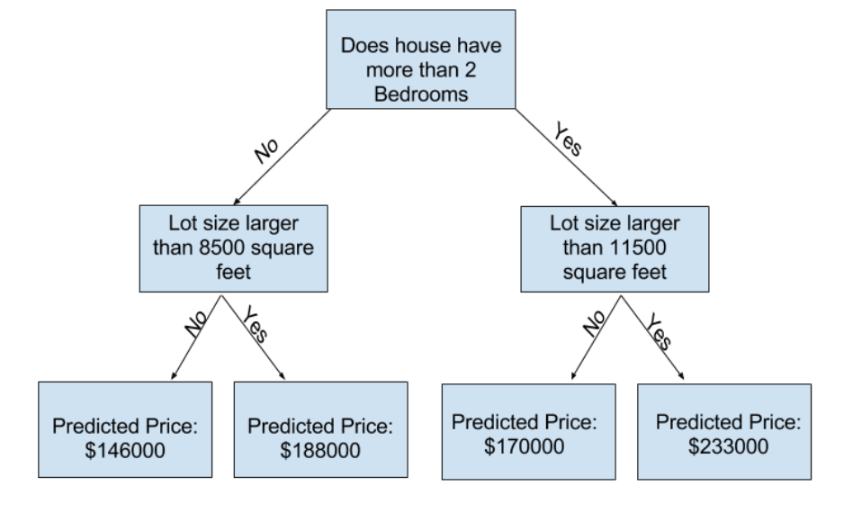

# Overview

## Course

Link: [https://www.kaggle.com/learn/intro-to-machine-learning](https://www.kaggle.com/learn/intro-to-machine-learning)

## Part 1

### Thoughts

- Machine learning basically is a group of techniques to predict and find patterns
- Python is a great language for it because it has a great interface with C and it is pretty fast. Also, it already has some great libraries to help us like Panda and sklearn
- We can parse a csv using Panda
- We can get helpful information like count, std, min, max, 25%, 50%, and 75%
- With Panda, we can describe and see the csv columns as well

- We can define the target by y
- We can define the features by X
- Features are the columns used to train our model
- y is the target, the final output (e.g. in our example, the house price)

- We can easily train our model by using sklearn
- There different models out there, today we will use Decision Tree

Decision Tree:


### Example

```python
import pandas as pd
from sklearn.tree import DecisionTreeRegressor

# Path of the file to read
iowa_file_path = '../input/home-data-for-ml-course/train.csv'

home_data = pd.read_csv(iowa_file_path)

y = home_data.SalePrice

# Create the list of features below
feature_names = ['LotArea', 'YearBuilt', '1stFlrSF', '2ndFlrSF', 'FullBath', 'BedroomAbvGr', 'TotRmsAbvGrd']

# Select data corresponding to features in feature_names
X = home_data[feature_names]

# Review data
# print description or statistics from X
print('description or statistics from X')
print(X.describe())

# print the top few lines
print('top few lines from features')
print(X.head())

#specify the model.
#For model reproducibility, set a numeric value for random_state when specifying the model
iowa_model = DecisionTreeRegressor(random_state=1)

# Fit the model
iowa_model.fit(X, y)

# Predictions
predictions = iowa_model.predict(X)
print(predictions)

# Comparing predictions from CSV and our model
print('predictions from csv top 5 rows')
print(y.head())

top_predictions = iowa_model.predict(X.head())
print('predictions from model top 5 rows')
print(top_predictions)
```

### Explanation

### Fit (trainging)

| House | Bedrooms | Backyard | Bathrooms | Backyard | Price    | Door Collor | Price generated by machine |
| ----- | -------- | -------- | --------- | -------- | -------- | ----------- | -------------------------- |
| #1    | 1        | 1        | 1         | No       | $100,000 | Yellow      | $100,000                   |
| #2    | 2        | 2        | 2         | No       | $200,000 | Yellow      | $100,000                   |
| #3    | 3        | 3        | 3         | Yes      | $350,000 | Green       | $300,000                   |
| #4    | 3        | 3        | 3         | No       | ?        | Green       | ?                          |

### Patterns

- Each bedroom raises $100,000
- Backyard raises $50,000
- Door colors don't matter

### Why is machine learning important?

Because we can easily find patterns with a small dataset, we cannot find patterns with huge dataset though.

### MAE

MAE = $500
MAE = $30,000

Small number groups => Underfitting

Yellow doors: 2 houses, $100,000 and $200,000, avg => $150,000

Raise the number of leafs, please create more groups => Overfitting

1 Bedrooms, No Backyard, 1 Bathroom, Yellow Door
2 Bedrooms, No Backyard, 2 Bathroom, Yellow Door
3 Bedrooms, Yes Backyard, 4 Bathroom, Green Door

## Part 2

### Validate our data

### Underfitting vs Overfitting

- Overfitting: capturing spurious patterns that won't recur in the future, leading to less accurate predictions, or
- Underfitting: failing to capture relevant patterns, again leading to less accurate predictions.

Defining node leafs could lead us to a better accuracy. Trying different max node leafs could bring the best number of groups on the final fitting.

```python
# Code you have previously used to load data
import pandas as pd
from sklearn.metrics import mean_absolute_error
from sklearn.model_selection import train_test_split
from sklearn.tree import DecisionTreeRegressor


# Path of the file to read
iowa_file_path = '../input/home-data-for-ml-course/train.csv'

home_data = pd.read_csv(iowa_file_path)
# Create target object and call it y
y = home_data.SalePrice
# Create X
features = ['LotArea', 'YearBuilt', '1stFlrSF', '2ndFlrSF', 'FullBath', 'BedroomAbvGr', 'TotRmsAbvGrd']
X = home_data[features]

# Split into validation and training data
train_X, val_X, train_y, val_y = train_test_split(X, y, random_state=1)

# Specify Model
iowa_model = DecisionTreeRegressor(random_state=1)
# Fit Model
iowa_model.fit(train_X, train_y)

# Make validation predictions and calculate mean absolute error
val_predictions = iowa_model.predict(val_X)
val_mae = mean_absolute_error(val_predictions, val_y)
print("Validation MAE: {:,.0f}".format(val_mae))

def get_mae(max_leaf_nodes, train_X, val_X, train_y, val_y):
    model = DecisionTreeRegressor(max_leaf_nodes=max_leaf_nodes, random_state=0)
    model.fit(train_X, train_y)
    preds_val = model.predict(val_X)
    mae = mean_absolute_error(val_y, preds_val)
    return(mae)

# Write loop to find the ideal tree size from candidate_max_leaf_nodes
candidate_max_leaf_nodes = [5, 25, 50, 100, 250, 500]
for max_leaf_nodes in candidate_max_leaf_nodes:
    my_mae = get_mae(max_leaf_nodes, train_X, val_X, train_y, val_y)
    print("Max leaf nodes: %d \t\t Mean Absolute Error: %d" %(max_leaf_nodes, my_mae))

```
