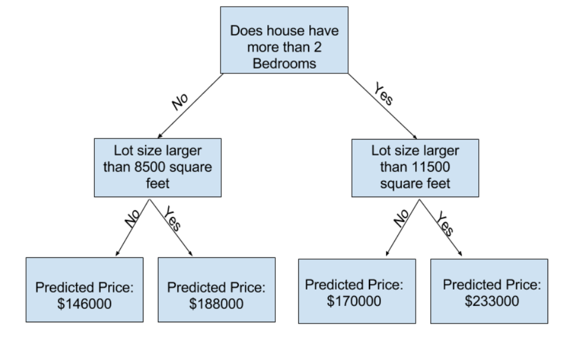

# Overview [1/2]

## Course

Link: [https://www.kaggle.com/learn/intro-to-machine-learning](https://www.kaggle.com/learn/intro-to-machine-learning)

## Thoughts

- Machine learning basically is a group of techniques to predict and find patterns
- Python is a great language for it because it has a great interface with C and it is pretty fast. Also, it already has some great libraries to help us like Panda and sklearn
- We can parse a csv using Panda
- We can get helpful information like count, std, min, max, 25%, 50%, and 75%
- With Panda, we can describe and see the csv columns as well

- We can define the target by y
- We can define the features by X
- Features are the columns used to train our model
- y is the target, the final output (e.g. in our example, the house price)

- We can easily train our model by using sklearn
- There different models out there, today we will use Decision Tree

Decision Tree:


## Example

```python
import pandas as pd
from sklearn.tree import DecisionTreeRegressor

# Path of the file to read
iowa_file_path = '../input/home-data-for-ml-course/train.csv'

home_data = pd.read_csv(iowa_file_path)

y = home_data.SalePrice

# Create the list of features below
feature_names = ['LotArea', 'YearBuilt', '1stFlrSF', '2ndFlrSF', 'FullBath', 'BedroomAbvGr', 'TotRmsAbvGrd']

# Select data corresponding to features in feature_names
X = home_data[feature_names]

# Review data
# print description or statistics from X
print('description or statistics from X')
print(X.describe())

# print the top few lines
print('top few lines from features')
print(X.head())

#specify the model.
#For model reproducibility, set a numeric value for random_state when specifying the model
iowa_model = DecisionTreeRegressor(random_state=1)

# Fit the model
iowa_model.fit(X, y)

# Predictions
predictions = iowa_model.predict(X)
print(predictions)

# Comparing predictions from CSV and our model
print('predictions from csv top 5 rows')
print(y.head())

top_predictions = iowa_model.predict(X.head())
print('predictions from model top 5 rows')
print(top_predictions)
```

## Explanation

### Fit (trainging)

         Bedrooms        Bathrooms       Backyard       Price

House #1 1 1 No $100,000
House #2 2 2 No $200,000
House #3 3 3 Yes $350,000

### Patterns

- Each bedroom raises $100,000
- Backyard raises $50,000

### New input to predict

House #4 4 4 Yes => Final? => $450,000
House #5 4 4 No => Final? => $400,000

### Why is machine learning important?

Because we can easily find patterns with a small dataset, we cannot find patterns with huge dataset though.
